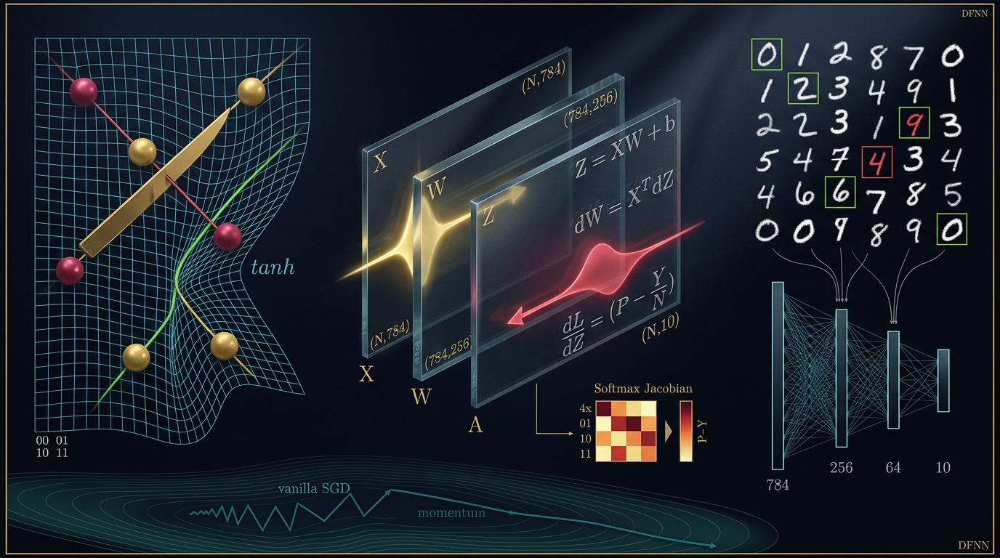
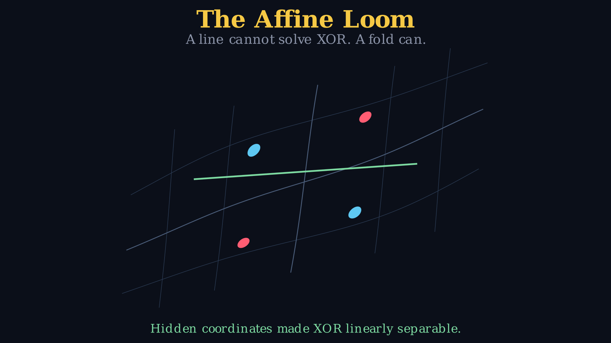
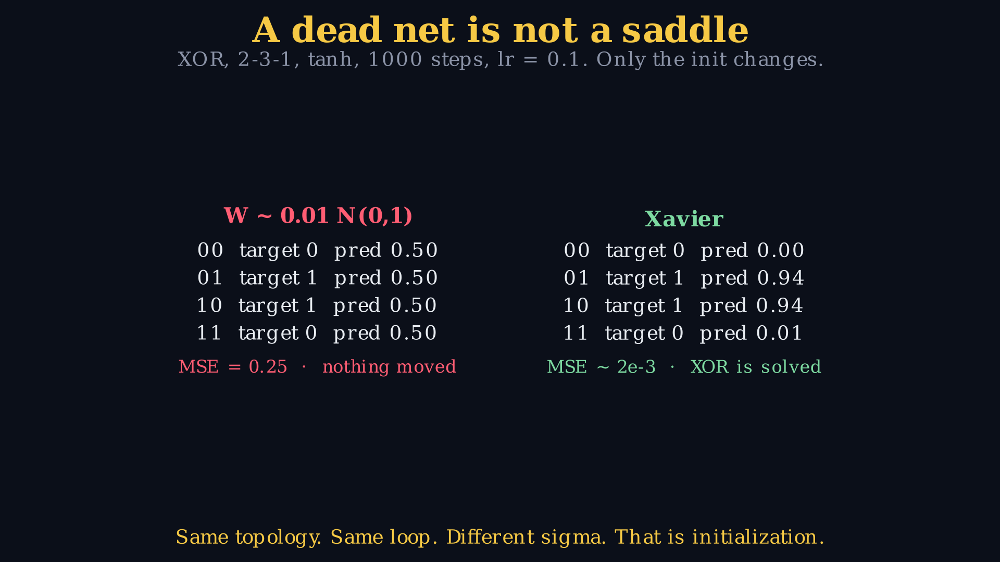
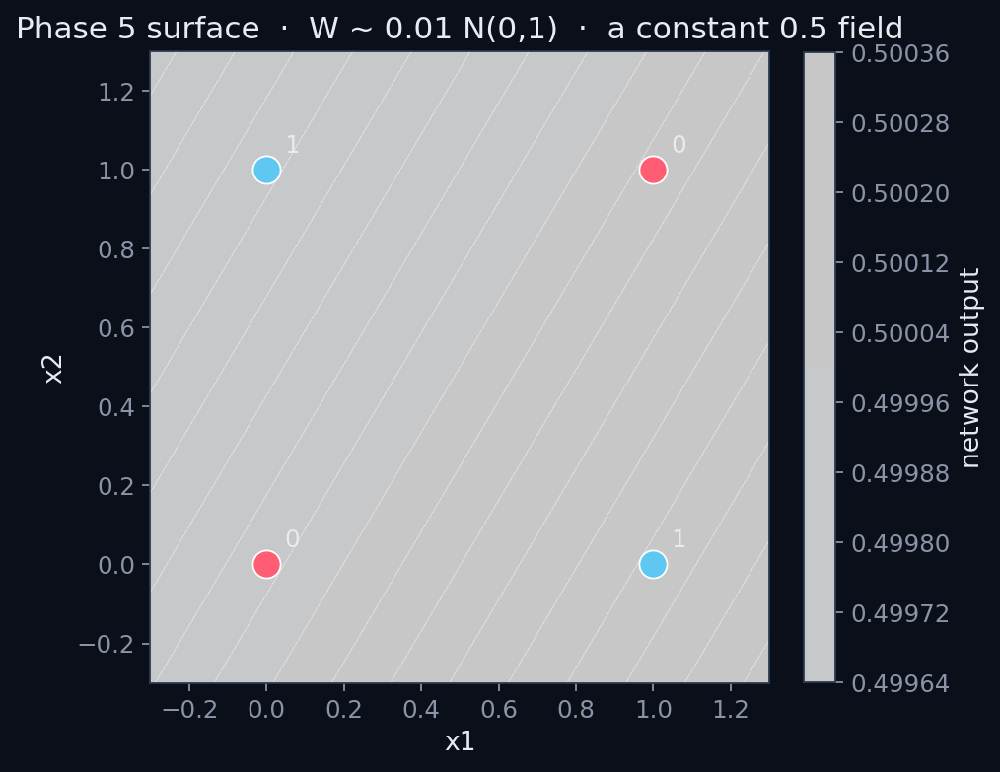
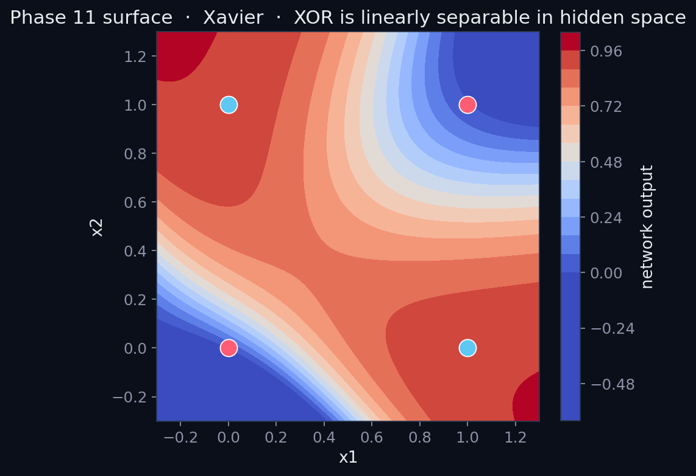
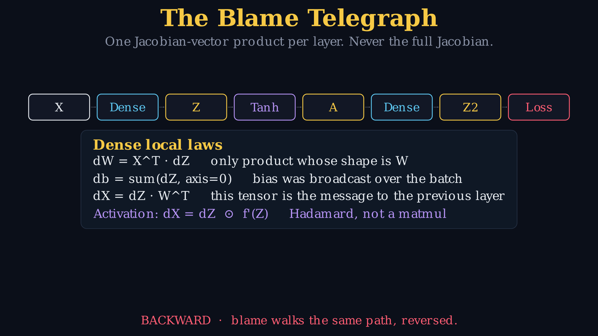
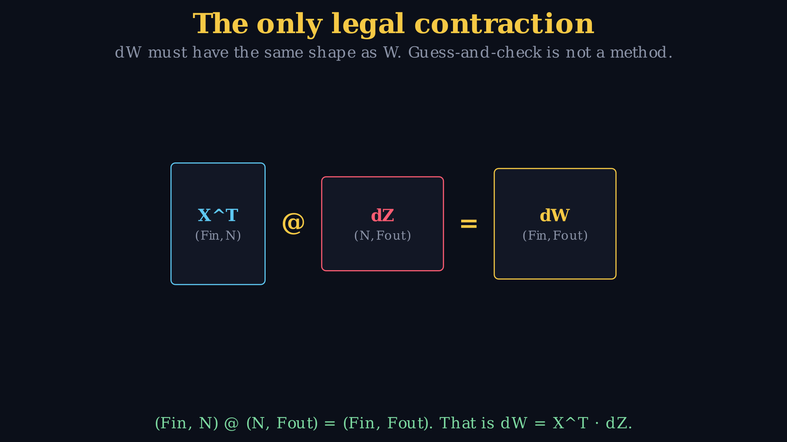
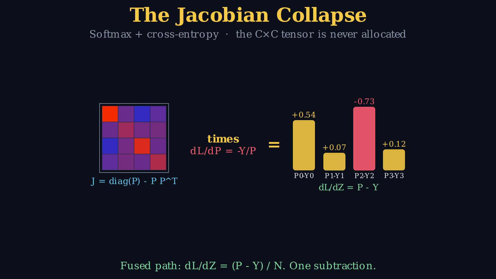
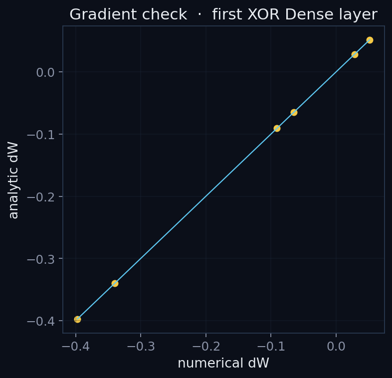
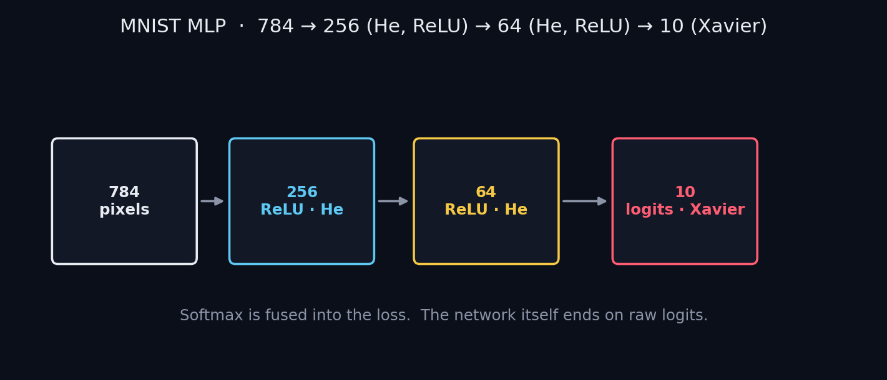

# DFNN - Dependency Free Neural Network 🧐

A multilayer perceptron written in NumPy. Forward, reverse-mode autodiff, SGD with momentum, He / Xavier init, fused softmax-cross-entropy, and a raw IDX parser for MNIST. No PyTorch. No TensorFlow. No Keras.

The whole engine lives in one notebook: [`Neural_Network_From_Scratch.ipynb`](Neural_Network_From_Scratch.ipynb).

<p align="center">
  
</p>

<!--
HERO IMAGE PROMPT (regenerate figures/hero.png if you want a different take).
Copy everything between the dashed lines into Midjourney / Flux / SD3 / whatever you use.

----------
Ultra-wide 16:9 museum-print scientific poster for a GitHub repo that builds a neural network from scratch in NumPy. Dark void #0B0F19, gold hairline frame. Not a glowing brain. Not a robot. Not circuit-board anatomy.

LEFT: a 2D coordinate fabric like cloth on a loom, cyan grid lines first sheared by a linear map then folded by tanh. Four XOR beads on the two diagonals (crimson = class 0, gold = class 1), labels 00, 01, 10, 11. A gold knife trying a straight cut and failing. A green curve that actually separates them after the fold.

CENTER: three smoked-glass matrix slabs in perspective, engraved X (N,784), W (784,256), Z = XW+b. A gold forward pulse left to right. A crimson backprop pulse right to left. Engraved identities that must be exactly these, no extra slashes: dW = X^T dZ , db = sum(dZ) , dX = dZ W^T , dL/dZ = (P-Y)/N. Below the slabs, a 4x4 softmax Jacobian heatmap collapsing into a thin P-Y bar. Caption: Softmax Jacobian.

RIGHT: grainy phosphor MNIST digits 0-9, a few lime boxes on correct reads, one crimson box on a 4/9 mixup. Digits drain into a 784-256-64-10 column diagram with sparse cyan wires.

BOTTOM: a ravine contour, vanilla SGD zigzag vs a smoother momentum path.

Materials: anodized metal, smoked glass, chalk dust, film grain, NASA-patch seriousness, 3Blue1Brown geometry, Scientific American cover. Tiny DFNN in gold, top-right. No watermark, no stock-photo people, no UI mockups.
----------
-->

<p align="center">
  <a href="LICENSE"></a>
  
  
  
  
  
</p>

## Contents

- [DFNN](#dfnn)
  - [Contents](#contents)
  - [Why this exists](#why-this-exists)
  - [Install and run](#install-and-run)
  - [What you get](#what-you-get)
  - [Gallery](#gallery)
  - [Cinematics](#cinematics)
  - [The identities that have to be right](#the-identities-that-have-to-be-right)
  - [References](#references)
  - [License](#license)

## Why this exists

`loss.backward()` is one line. The reason it works is three matrix products and a Hadamard product, and most people who ship models have never written them.

This repo is that missing page:

1. XOR with tiny Gaussian weights sits at prediction `0.5`. Same net, Xavier init, same 1000 steps, loss ~ `2e-3`.
2. A numerical gradient check on `dW` lands at relative error `8.7e-12`.
3. MNIST from the raw IDX bytes, 40 epochs. The notebook in this tree finished at **98.04 percent** test accuracy and 100 percent train accuracy. That gap is overfitting, not a mystery.

The notebook is allowed to redefine `Dense`, `Activation`, and `SoftmaxCrossEntropy` as you go. Early cells are the historical artifact. Later cells are the engine you would actually keep.

## Install and run

```bash
git clone <this-repo>
cd <this-repo>
python -m venv .venv && source .venv/bin/activate
pip install -r requirements.txt
jupyter notebook Neural_Network_From_Scratch.ipynb
```

Then **Run All**. First launch downloads four MNIST `.gz` files and checks them against the [TensorFlow Datasets SHA-256 checksums](https://github.com/tensorflow/datasets/blob/master/tensorflow_datasets/url_checksums/mnist.txt).

The learning code is NumPy. Matplotlib draws figures. Manim Community is optional; the MP4s already live in [`visualizations/rendered/`](visualizations/rendered/).

## What you get

| Path | What it is |
| --- | --- |
| [`Neural_Network_From_Scratch.ipynb`](Neural_Network_From_Scratch.ipynb) | The course. 18 sections, XOR, gradient check, MNIST. |
| [`visualizations/manim_scenes.py`](visualizations/manim_scenes.py) | Five Pango-only Manim scenes. No LaTeX. |
| [`visualizations/diagrams.py`](visualizations/diagrams.py) | Static posters used by the notebook and this README. |
| [`figures/`](figures/) | Last frames and matplotlib PNGs. |
| [`LICENSE`](LICENSE) | MIT. |

Do not commit `*.gz`, `uploads/`, or assembler scrap. `.gitignore` already blocks the gzip files.

## Gallery

Here are some best Vizs; Open the notebook if you want the rest next to the code that earned them.

**XOR is two diagonals. A line cannot cut them. A fold can.**

<p align="center">
  
</p>

**Same 2-3-1 tanh net. Left: W ~ 0.01 N(0,1), MSE = 0.25. Right: Xavier, XOR solved.**

<p align="center">
  
</p>

<p align="center">
  
  
</p>

**Backprop is a protocol. One Jacobian-vector product per layer.**

<p align="center">
  
</p>

**The only product whose shape is W:**

<p align="center">
  
</p>

**Softmax + cross-entropy never allocates the C x C Jacobian. The fused gradient is (P - Y) / N.**

<p align="center">
  
</p>

**The calculus is not a vibe. Finite differences vs `dW`:**

<p align="center">
  
</p>

**MNIST topology that actually trains:** `784 → 256 (He, ReLU) → 64 (He, ReLU) → 10 (Xavier)`, softmax fused into the loss.

<p align="center">
  
</p>

## Cinematics

Five short films, 720p30, Pango `Text` only.


| File | Scene | Point |
| --- | --- | --- |
| [`01_affine_loom.mp4`](visualizations/rendered/01_affine_loom.mp4) | AffineLoom | Linear maps shear. Tanh folds. XOR becomes linearly separable. |
| [`02_blame_telegraph.mp4`](visualizations/rendered/02_blame_telegraph.mp4) | BlameTelegraph | Cache X and Z going forward. Walk the same path backward. |
| [`03_jacobian_collapse.mp4`](visualizations/rendered/03_jacobian_collapse.mp4) | JacobianCollapse | `diag(P) - P P^T` times `-Y/P` is `P - Y`. |
| [`04_chain_rule_contract.mp4`](visualizations/rendered/04_chain_rule_contract.mp4) | ChainRuleContract | `(Fin, N) @ (N, Fout) = (Fin, Fout)`. |
| [`05_dead_signal.mp4`](visualizations/rendered/05_dead_signal.mp4) | DeadSignal | Tiny init is not a saddle. It is a network that has not moved. |

If `ffmpeg` is missing, `imageio-ffmpeg` ships a binary. The notebook prepends it to `PATH` when needed.

## The identities that have to be right

Dense, `Z = X W + b`, batch axis 0:

```
dW = X.T @ dZ          # (Fin, Fout)
db = dZ.sum(axis=0, keepdims=True)
dX = dZ @ W.T
```

Activation:

```
dX = dZ * f'(Z)        # Hadamard, not a matmul
```

Fused softmax + mean categorical cross-entropy:

```
dZ = (P - Y) / N
```

MSE with `np.mean` matches PyTorch `MSELoss(reduction="mean")`: divide by the number of elements, not by batch size alone. [Docs](https://pytorch.org/docs/stable/generated/torch.nn.MSELoss.html).

Xavier (Glorot normal) uses `sqrt(2 / (fan_in + fan_out))`. He uses `sqrt(2 / fan_in)`. Keras `glorot_normal` is the truncated-normal cousin of the same scale.

The notebook's SGD is an EMA smoother `v = β v + (1-β) g`. It is **not** bit-identical to Polyak heavy ball or to `torch.optim.SGD(momentum=β)`.

## References

Papers this code actually implements, with a URL you can click:

1. Rumelhart, Hinton, Williams (1986). Learning representations by back-propagating errors. *Nature*. [doi:10.1038/323533a0](https://doi.org/10.1038/323533a0)
2. Glorot, Bengio (2010). Understanding the difficulty of training deep feedforward neural networks. *AISTATS*. [PDF](https://proceedings.mlr.press/v9/glorot10a/glorot10a.pdf)
3. He, Zhang, Ren, Sun (2015). Delving deep into rectifiers. *ICCV*. [PDF](https://openaccess.thecvf.com/content_iccv_2015/papers/He_Delving_Deep_into_ICCV_2015_paper.pdf)
4. Kingma, Ba (2015). Adam: A method for stochastic optimization. *ICLR*. [arXiv:1412.6980](https://arxiv.org/abs/1412.6980)
5. Srivastava, Hinton, Krizhevsky, Sutskever, Salakhutdinov (2014). Dropout. *JMLR*. [HTML](https://jmlr.org/papers/v15/srivastava14a.html) · [PDF](https://jmlr.org/papers/volume15/srivastava14a/srivastava14a.pdf)
6. Polyak (1964). Some methods of speeding up the convergence of iteration methods. [doi:10.1016/0041-5553(64)90137-5](https://doi.org/10.1016/0041-5553(64)90137-5)
7. Cybenko (1989). Approximation by superpositions of a sigmoidal function. [doi:10.1007/BF02551274](https://doi.org/10.1007/BF02551274)
8. Hornik (1991). Approximation capabilities of multilayer feedforward networks. [doi:10.1016/0893-6080(91)90009-T](https://doi.org/10.1016/0893-6080(91)90009-T)
9. Dauphin et al. (2014). Identifying and attacking the saddle point problem. *NeurIPS*. [arXiv:1406.2572](https://arxiv.org/abs/1406.2572)
10. LeCun, Cortes, Burges. The MNIST database. [yann.lecun.com/exdb/mnist](http://yann.lecun.com/exdb/mnist/)
11. Bridle (1990). Probabilistic interpretation of feedforward classification network outputs. [doi:10.1007/978-3-642-76153-9_28](https://doi.org/10.1007/978-3-642-76153-9_28)
12. TensorFlow Datasets, MNIST checksums: [`mnist.txt`](https://github.com/tensorflow/datasets/blob/master/tensorflow_datasets/url_checksums/mnist.txt)
13. PyTorch `MSELoss` reduction `mean`: [docs](https://pytorch.org/docs/stable/generated/torch.nn.MSELoss.html)

Visual primers, not papers: [3Blue1Brown, Neural Networks](https://www.youtube.com/playlist?list=PLZHQObOWTQDNU6R1_67000Dx_ZCJB-3pi) · [Karpathy, micrograd](https://www.youtube.com/watch?v=VMj-3S1tku0)

## License

[MIT](LICENSE).
